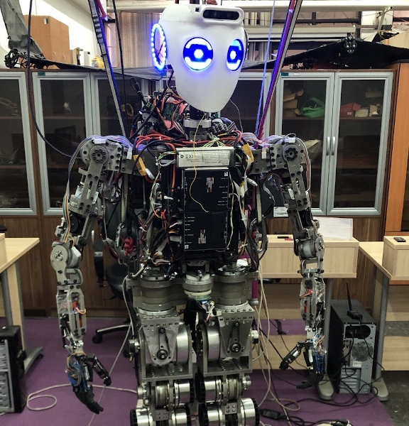

# Surena-V

<p align="center">
  
</p>

**This repository serves as our ROS workspace for operating the Surena-V humanoid robot, encompassing the most up-to-date stable packages for Control, Electronics, and AI.**

## About

The Surena project is Iran's national initiative in humanoid robotics, and Surena-V is its fifth iteration currently under development at the University of Tehran's Center for Advanced Systems and Technologies (CAST). Committed to open-source principles, the project has made much of its codebase publicly available, with further documentation efforts planned to increase its accessibility and usefulness for others. This repository primarily focuses on the physical robot, housing all hardware code necessary for electronics and robot communication. It utilizes ROS1 (noetic) as the robotic middleware

## Getting Started

**Prerequisites**:

**ROS Noetic**: Ensure you have ROS Noetic installed on your system. If not, follow the official installation [instructions](http://wiki.ros.org/noetic/Installation).
**Dependencies**: Install the following required dependencies:
Qt5 library
OpenCV
Eigen

**Installation Steps**:

1. Clone the repository:
```
git clone https://github.com/<username>/surena-v.git
cd surena-v
```
2. Build the project:
```
catkin_make
```
## Usage

The workspace is organized into distinct packages, each responsible for specific functionalities:

1. **trajectory_planner**: Handles the core trajectory generation and control aspects of the robot.
2. **surena_eth**: Manages the robot's electronics and communication.


## Have a question or want to contribute?

Whether you've encountered an issue using Surena-V or have amazing ideas for new features, we're all ears! Here's how you can get involved:

**Questions and Troubleshooting**:

1. **Issues**: Head over to the "Issues" section of this repository. Feel free to create a new issue, detailing your problem or question. Be sure to provide as much information as possible, such as any error messages or specific scenarios you're facing. 
2. **Discussions**: If your question is more general or you're looking for broader community insights, don't hesitate to start a discussion.

**Contributions and Collaboration**:

1. **Fork the Project**: Take a copy of the Surena-V codebase and make it your own! This is the first step to contributing improvements and new features.
2. **Pull Requests**: Once you've made some awesome changes, create a pull request.
